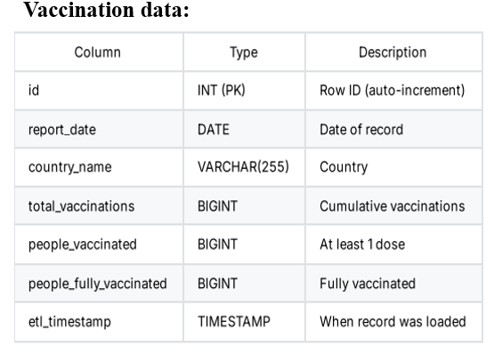

# Project Overview

This project offers a robust Python command-line tool for analyzing healthcare data statistics using automated ETL (Extract, Transform, Load) processes. By directly integrating with a public API, you can effortlessly collect, clean, and load up-to-date COVID-19 case and vaccination data into a persistent MySQL database. The CLI enables users to query, track, and visualize healthcare trends across countries with reproducible commands, supporting effective research and reporting.

# KEY FEATURES

Automated Data Retrieval: Automatically fetches up-to-date global COVID-19 case and vaccination data from the public Our World in Data (OWID) CSV API.

Robust Data Transformation: Cleans, filters by country and date range, handles missing values, and normalizes data into a consistent format suitable for analysis.

Reliable MySQL Storage: Stores processed data in two structured, normalized tables (daily_cases and vaccination_data) with duplicate prevention and timestamping.

Command-Line Interface: Provides a flexible CLI for users to fetch data, execute queries (e.g., total cases, daily trends, top countries), list or drop tables, enabling rapid and reproducible analyses.

Modular and Extensible Design: Codebase is clearly separated into modules (API client, transformer, DB handler, CLI) for maintainability and future scalabili

# Installation and Setup (Except Cloning)

### Install Python Dependencies
Ensure you have Python 3.7 or higher installed. Install the required Python packages using:

### text
pip install -r requirements.txt
Install and Configure MySQL
Make sure you have MySQL Server 5.7 or higher installed and running on your machine.
Then, create a new database for the project (you can name it as you like, e.g., covid_healthcare):

### sql
CREATE DATABASE covid_healthcare;
Configure Database Connection
Edit the config.ini file in your project root to add your MySQL connection credentials and database name:

text
[mysql]
host = localhost
user = your_mysql_username
password = your_mysql_password
database = covid_healthcare
Create Database Tables
You can create the required tables either manually or let the CLI create them automatically upon first run. To create manually, run the SQL script:

text
mysql -u your_mysql_username -p covid_healthcare < sql/create_tables.sql
Ready to Use
The project is now set up to fetch, load, and analyze COVID-19 data through CLI commands

## Public API and Data Details
Data Source: Our World in Data (OWID) COVID-19 dataset CSV

API Link: https://github.com/owid/covid-19-data/raw/master/public/data/owid-covid-data.csv

Data Coverage: Country-level daily records; cases, deaths, vaccinations, and other metrics

Update Frequency: Typically updated daily

Add image: API data flow or snippet from dataset

### project structure

main.py: CLI entry point
api_client.py: Extracts data
data_transformer.py: Data cleaning & structuring
mysql_handler.py: Database operations
config.ini: Settings (DB credentials, etc.)
sql/create_tables.sql: Table schemas
requirements.txt, README.md, docs/

## System Architecture

### Architecture Explanation

LI Interface (User Input): Main entry point where users enter commands to fetch data, update the database, or view reports.

API Fetcher (OWID COVID-19 API): Retrieves live data from the public  API, handling HTTP requests, parsing, and validation.

Database Module (MySQL Storage): Stores cleaned and structured data in MySQL for efficient querying, indexing, and long-term storage.

Analytics Module (Data Processing & Trends): Processes stored data to generate trends, comparisons, and insights using queries and visualizations.

Output (Reports, Charts, CLI Display): Delivers processed results as CLI text, tables.

# Database Schema Description
Table: daily_cases
Columns: id (PK), report_date, country_name, total_cases, new_cases, total_deaths, new_deaths, etl_timestamp

Table: vaccination_data
Columns: id (PK), report_date, country_name, total_vaccinations, people_vaccinated, people_fully_vaccinated, etl_timestamp

## ETL Process Description
Extract: Downloads the global COVID-19 CSV dataset from OWID’s API

Transform: Filters by country and date, cleans data (handles missing, converts types), normalizes formats

Load: Inserts cleaned data into MySQL tables with duplicate prevention

Analytics: Enables querying trends and summaries via CLI commands

# CLI Command Usage Guide
#### Fetch and load data:

python main.py fetch_data --country "Country_Name" --start_date YYYY-MM-DD --end_date YYYY-MM-DD --data_type [cases|vaccinations|all]

#### Query total cases:

python main.py query_data total_cases --country "Country_Name"

#### Fetch daily trends:

python main.py query_data daily_trends --country "Country_Name" --metric "new_cases"

#### Get top N countries by metric:

python main.py query_data top_n_countries_by_metric --n N --metric "total_vaccinations"

#### List tables in database:

python main.py list_tables

#### Drop all tables:

python main.py drop_tables

## RESULTS

#### Top country by total cases 

#### Top countries by vacination

#### Top countries by total Death

# Conclusion

This project successfully delivers a robust command-line tool for extracting, transforming, and loading global healthcare data into a MySQL database, enabling efficient and reproducible healthcare data analysis. Leveraging a trusted public dataset from public API it provides automated data processing and flexible querying capabilities via a user-friendly CLI. The modular design ensures maintainability and extensibility, making it a valuable resource for researchers and analysts. Future enhancements can further improve performance, usability, and analytical depth.

